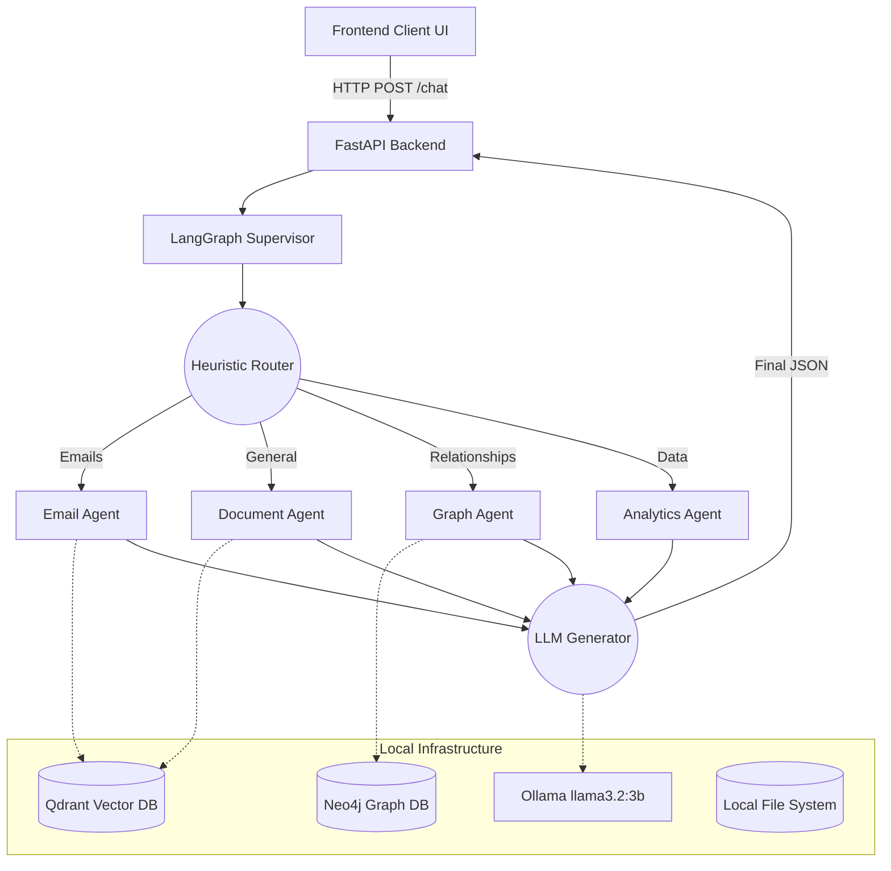

# Enterprise AI Knowledge Assistant

Enterprise AI Knowledge Assistant is a powerful, fully localized Retrieval-Augmented Generation (RAG) system integrated with a Multi-Agent Workflow. It securely processes enterprise documents, extracts vector embeddings, and builds graph relationships to accurately answer complex queries about your local infrastructure, workflows, and documents, all without relying on external cloud APIs to maintain strict data privacy.

---

## 📖 Table of Contents
1. [Features](#features)
2. [Prerequisites & Requirements](#prerequisites--requirements)
3. [System Architecture](#system-architecture)
4. [Data Ingestion Pipeline](#data-ingestion-pipeline)
5. [Query & Routing Pipeline](#query--routing-pipeline)
6. [Installation & Setup](#installation--setup)

---

## ✨ Features

- **100% Local & Private:** Runs entirely on your local machine using Ollama. No data is sent to OpenAI or cloud providers.
- **Multi-Agent Routing:** A LangGraph supervisor intelligently routes queries to specialized sub-agents (Document, Email, Graph, or Analytics).
- **Graph Database Integration:** Natively parses complex `.drawio` architecture diagrams into a Neo4j Graph Database, allowing you to trace routes and workflows.
- **Hybrid Document Search:** Uses Qdrant for semantic similarity combined with exact keyword and profile matching.
- **Automated Directory Watching:** An Event Manager automatically watches your folders (e.g., emails, contracts, sharepoint) and ingests new files in the background.
- **Multi-Format Support:** Ingests PDFs (with OCR), `.eml` emails, plain text, and native `.drawio` xml graphs.

---

## 🛠 Prerequisites & Requirements

Before setting up the project, ensure you have the following installed and running locally:

### Core Infrastructure
1. **[Ollama](https://ollama.com/)** - Running locally.
   - You must pull the primary LLM: `ollama run llama3.2:3b`
2. **[Qdrant](https://qdrant.tech/)** - Running locally (default port: `6333`).
   - Usually run via Docker: `docker run -p 6333:6333 qdrant/qdrant`
3. **[Neo4j](https://neo4j.com/)** - Running locally (default bolt port: `7687`).
   - Set up with authentication (default used in code is usually `neo4j` / `password`).

### Python Requirements
- **Python 3.10+**
- Core Libraries (Install via `pip`):
  - `fastapi`, `uvicorn` (Backend server)
  - `langgraph`, `requests` (Agent framework)
  - `qdrant-client`, `neo4j` (Database drivers)
  - `sentence-transformers` (for `all-MiniLM-L6-v2` embeddings)
  - `PyMuPDF`, `pdfplumber`, `pytesseract` (Document reading & OCR)
  - `pydantic` (Data validation)

---

## 🏗 System Architecture 

The project operates by connecting a modern web UI to a FastAPI backend that delegates complex tasks to LangGraph agents.



---

## 📥 Data Ingestion Pipeline

When a new file is dropped into a watched folder, the background **Event Manager** triggers the indexer:

1. **Extraction:** Extracts text (using standard parsing or Tesseract OCR for images).
2. **Profiling:** The LLM generates a concise Summary and extracts 5-10 core Keywords for the document profile.
3. **Graph Mapping:** If the file is a diagram (e.g., `.drawio`), nodes and routing paths are saved directly into Neo4j.
4. **Chunking & Embedding:** Text is chunked (e.g., 500 words), converted to dense vectors using `SentenceTransformers` (`all-MiniLM-L6-v2`), and upserted into Qdrant.

---

## 🧠 Query & Routing Pipeline

When a user asks a question, it enters the `supervisor_langgraph.py` pipeline:

1. **RouterNode:** Analyzes the question text and assigns it to a Target Agent based on keyword boundaries.
2. **Specialized Agents:**
   - **`document_agent.py`**: The workhorse. Uses an advanced 3-stage search (Profile Match, Semantic Vector Search, Exact Keyword Match) to pull chunks.
   - **`email_agent.py`**: Filters Qdrant specifically for `.eml` files or the `emails` directory.
   - **`graph_agent.py`**: Bypasses Qdrant and translates user questions into advanced Neo4j Cypher queries to traverse architecture nodes.
   - **`analytics_agent.py`**: Processes queries requiring mathematical operations or tabular CSV/Excel data.
3. **GeneratorNode:** Injects the retrieved database context into a strict prompt and asks LLaMA 3.2 to formulate the final answer based *only* on the provided context.

---

## 🚀 Installation & Setup

1. **Clone the repository:**
   ```bash
   git clone <repository_url>
   cd EnterpriseAI
   ```

2. **Set up the virtual environment:**
   ```bash
   python -m venv venv
   source venv/bin/activate  # On Windows: .\venv\Scripts\activate
   ```

3. **Install dependencies:**
   ```bash
   pip install -r requirements.txt
   ```

4. **Start the local databases & LLM:**
   - Ensure Qdrant, Neo4j, and Ollama are running in the background.

5. **Run the backend server:**
   ```bash
   python -u -m uvicorn backend.main:app --reload
   ```

6. **Access the Application:**
   Open your browser and navigate to `http://127.0.0.1:8000` to interact with the frontend Knowledge Assistant UI.